# Enrollment
Enrollment is a spring boot based microservice for tracking the status of enrollees in a health care program.

Requirements: 
- Enrollees must have an id, name, and activation status (true or false), and a birth date
- Enrollees may have a phone number (although they do not have to supply this)
- Enrollees may have zero or more dependents
- Each of an enrollee's dependents must have an id, name, and birth date

The Enrollee Microservice should  be able to do handle below operations: 
- Add a new enrollee
- Modify an existing enrollee
- Remove an enrollee entirely
- Add dependents to an enrollee
- Remove dependents from an enrollee
- Modify existing dependents

Prerequisites To Run the Microservice
1. Maven
2. Java Run Time
3. Mongo DB Installation
4. Docker and Docker Compose (For running containers and communicating. One container will have SpringBoot Microservice and other container will have MongoDB)

Steps: 
1. Download the code zip file or clone from github 
2.  Lets say D:\sample is the filepath where file is unzipped.
3. Please ensure to configure below mongo DB properties mentioned in the application.properties (src\main\resources\application.properties)
If mongo db is installed locally localhost will work otherwise IP can be provided. Default port is 27017 and DB name is enrollment. Collections will be created inside this DB automatically when we perform create operation from API.

spring.data.mongodb.host=localhost

spring.data.mongodb.port=27017

spring.data.mongodb.database=enrollment

4. Open command prompt and  Run mvn clean install (Please make sure that maven is in path)
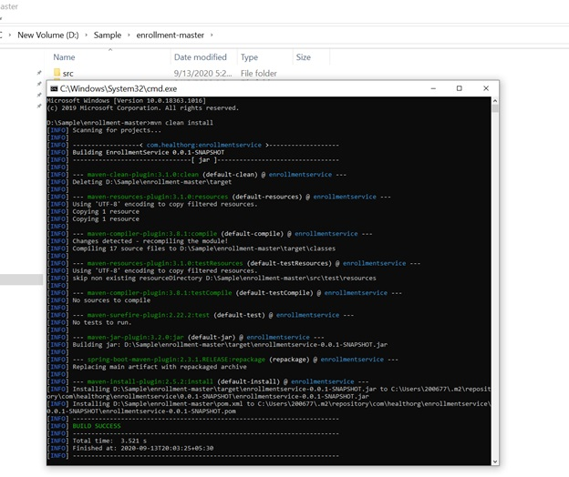

4. Executable jar will be present in D:\Sample\enrollment-master\target

Run below command from D:\Sample\enrollment-master\target

java -jar enrollmentservice-0.0.1-SNAPSHOT.jar

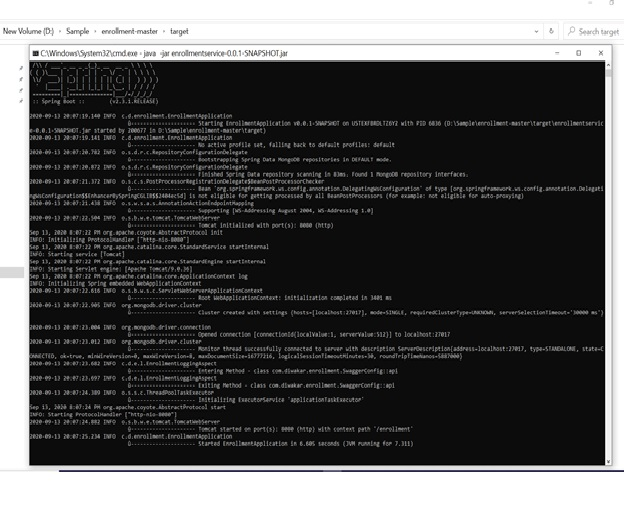
 

Now the embedded tom cat server is started and microservice is up and running. Documentation for API can be checked using Swagger by hitting below url.

http://localhost:8080/enrollment/swagger-ui/

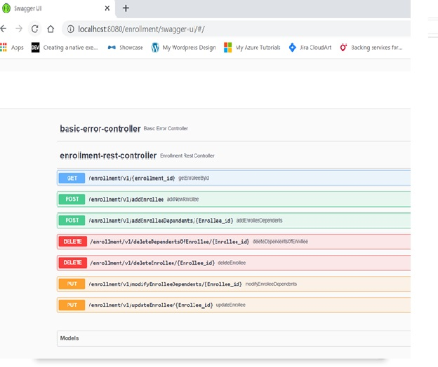

Below are the API end points testing screenshots from postman.

1.  Add New Enrollee

 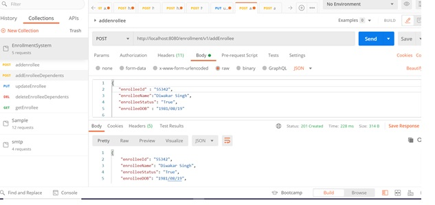
 
 2. Get Enrollee
 
 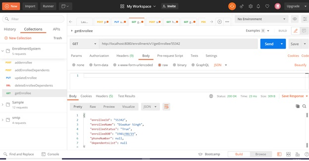
 
 3. Update Enrollee
 
 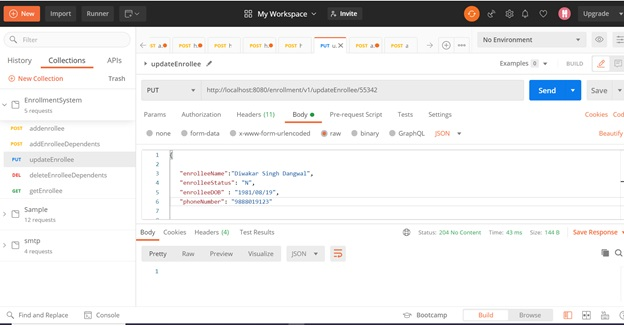
 
 4. Delete Enrollee
 
 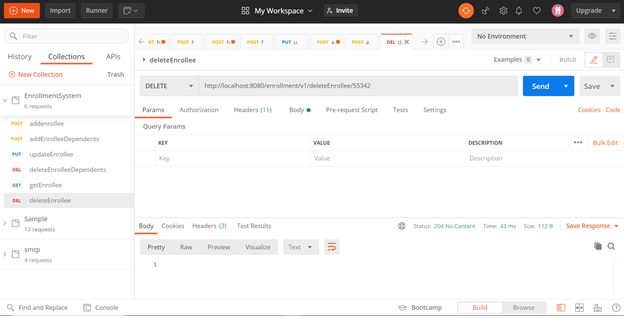
 
 5. Add dependents of Enrollee
 
 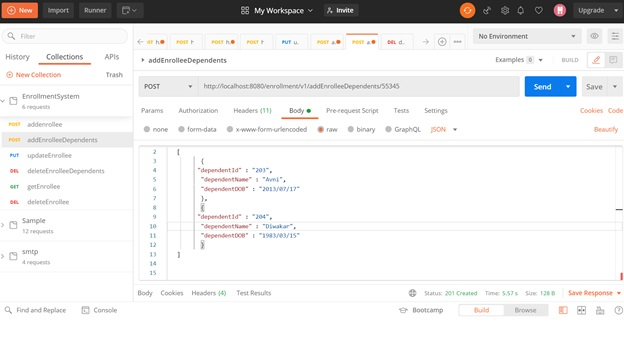
 
 6. Update dependents of Enrollee
 
 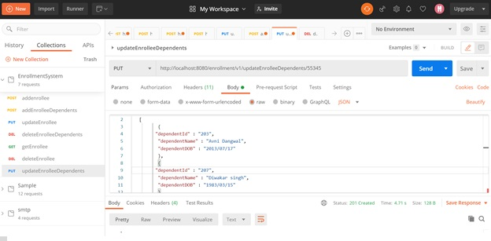
 
 7. Delete dependents of Enrollee
 
 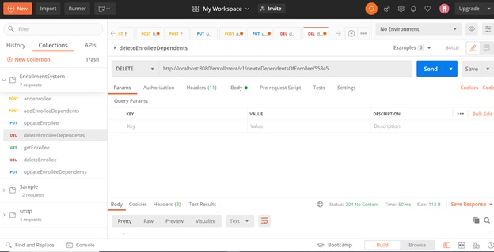
 
 
 
 Dockerization Of Microservice ----
 
Changes in application.properties :
Comment out mongodb host port and DB as below
#spring.data.mongodb.host=localhost
#spring.data.mongodb.port=27017
#spring.data.mongodb.database=enrolment

Add URI key as below in application.properties

dockerspring.data.mongodb.uri=mongodb://mymongocontainer:27017/enrolment

Now create a docker file , sample is already present in the repo
Create a Docker File

FROM openjdk:8-jdk-alpine
VOLUME /tmp
ADD  target/enrollment-v1.jar .
ENTRYPOINT ["java","-Dspring.data.mongodb.uri=mongodb://mymongocontainer:27017/enrollment", "-jar","/enrollment-v1.jar"]

Now execute maven - by adding below plugin in pom.xml . In configuration tag please provide the dockerhub repo 

<plugin>
				<groupId>com.spotify</groupId>
				<artifactId>dockerfile-maven-plugin</artifactId>
				<version>${dockerfile-maven-version}</version>
				<executions>
					<execution>
						<id>default</id>
						<goals>
							<goal>build</goal>
							<goal>push</goal>
						</goals>
					</execution>
				</executions>
				<configuration>
					<username>diwakardangwal</username>
					<password>putyourpassword</password>     ------ do provide ur usrname and password for dockerhub
					<repository>diwakardangwal/myrepository</repository>
					<tag>enrolv1</tag>
				</configuration>
</plugin>

mvn clean install

This will build the project as well as create a image for the application.

Now push the created image in docker hub

docker push diwakardangwal/myrepository:enrolv1

 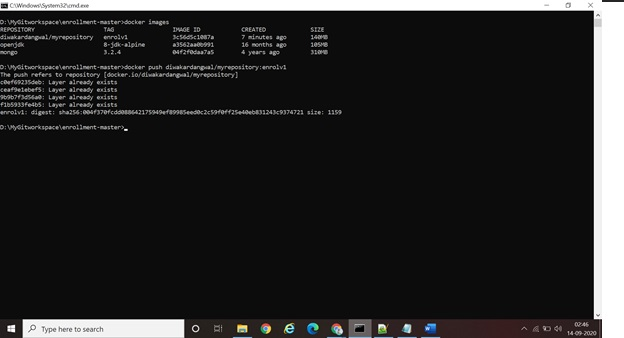

Create Docker Compose File so that 2 containers can communicate with each other

create docker-compose.yml

version: "1"
services:
  mongodb:
    image: mongo:3.2.4
    container_name: "mymongocontainer"    
    command: --smallfiles
  app:
    image: diwakardangwal/myrepository:enrolv1
    ports:
    - 8080:8080
    links:
    - mongodb
    depends_on:
    - mongodb

Now execute

docker-compose pull

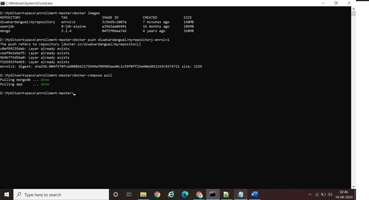

docker-comppse up

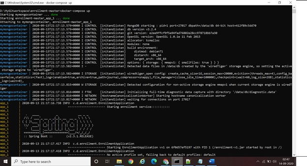

Application will be up and running with MongoDB and all the operations listed above can be performed.

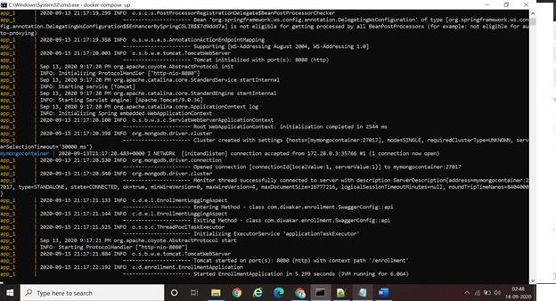

Running containers on docker can be seen by  
docker container ls -a 

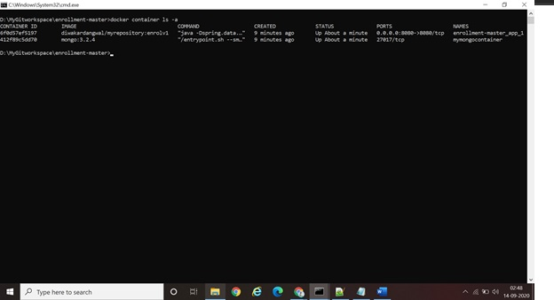

 
 
